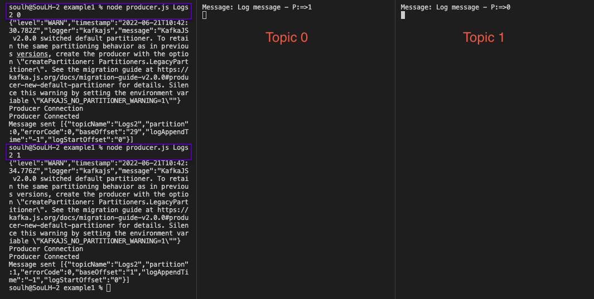

# Apache-Kafka 

### Starting (M1-ARM64)

[Kafka Download](https://www.apache.org/dyn/closer.cgi?path=/kafka/3.2.0/kafka_2.13-3.2.0.tgz)

```
Start ZooKeeper Service

bin/zookeeper-server-start.sh config/zookeeper.properties

```

```
Start Kafka

bin/kafka-server-start.sh config/server.properties

```


```
Inıt
npm init -y
```


```
Download kafkajs

npm install --save kafkajs
```

```
Create Topic

node topic.js
```

```
Send Message

node producer.js Logs2 0 
node producer.js Logs2 1
```

```
Logs1: simple topic {0}
Logs2: multi topic {0,1}
```


<p>
    

</p>

#

####    Thank You Kablosuzkedi