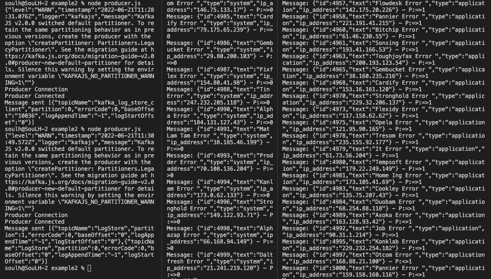

# Apache-Kafka Reading Json 

### Starting (M1-ARM64)

[Kafka Download](https://www.apache.org/dyn/closer.cgi?path=/kafka/3.2.0/kafka_2.13-3.2.0.tgz)

```
Start ZooKeeper Service

bin/zookeeper-server-start.sh config/zookeeper.properties

```

```
Start Kafka

bin/kafka-server-start.sh config/server.properties

```


```
Inıt
npm init -y
```


```
Download kafkajs

npm install --save kafkajs
```

```
Create Topic

node topic.js
```

```
Send Message

node producer.js
```

```
Read Message


node consumer.js  //Tread 1

node consumer.js //Tread 2
```


<p>
    

</p>

#

####    Thank You Kablosuzkedi